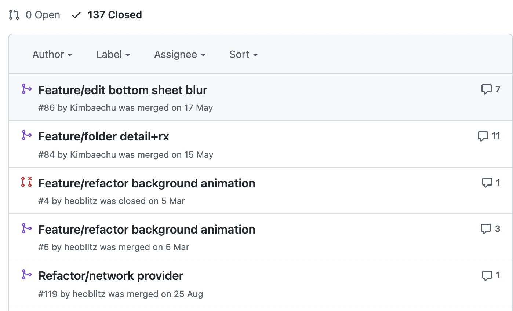

# 링크모아
  

링크모아는 소중한 링크들을 쉽게 찾아보고 정리할 수 있는 서비스입니다.
다양한 주제에 맞게 링크를 정리하고 공유함으로써 지식을 쉽게 공유할 수 있습니다.

## 프로젝트 구조

 

유연하고 재사용가능한 서비스를 만들기 위해서 앱을 모듈화 하였습니다.

- LinkMoaBottomSheet: Custom Bottom Sheet 프레임워크
- LinkMoaCore: 네트워크 및 저장소 프레임워크
- LinkMoaKit: Assets, Fonts 및 Helper Class 프레임워크

## 프로젝트 주요 관심사

### 코드
- 깔끔한 코드를 위한 지속적인 리팩토링 진행
- Style Share 와 카카오 모빌리티 코드 컨벤션을 종합하여 준수

### 아키텍처
- MVVM 방식을 채택하여 사용
- 기존에는 KickStarter ViewModel 구조와 클로저를 이용하여 데이터 바인딩을 했지만 현재는 CleanArchitecture 를 참고하여 RX 사용한 방식으로 구조 변경

관련 게시글: https://linux-studying.tistory.com/28

### 반응형 프로그래밍
- RxSwift 를 사용하여 데이터 바인딩과 네트워크를 선언형으로 작성
- Rx 프레임워크의 설계 방향성을 준수하기 위해 ViewModel 에서 이벤트는 Signal / 상태는 Driver 로 구분하여 사용

### 브랜치 관리 전략
 

- develop, feature 브랜치를 구분지어 사용
- 모든 PR 은 코드 리뷰를 통해서 승인되어야 머지 가능

### 프로젝트 관리 및 모듈화
- 협업시에 발생하는 xcodeproj 충돌을 방지하기 위해 tuist 로 프로젝트 파일을 관리
- git hooks 을 통해 프로젝트 파일을 브랜치마다 동적으로 생성하여 사용
- 앱 로직을 프레임워크로 분리함으로써 기능 간의 의존성을 명확하게 하고 빌드 시간을 단축할 수 있음

### 테스트
  
  

- Kit, Core, BottomSheet 각 프레임워크에 대한 테스트 코드 작성
- Given, When, Then 을 구분지어 사용하는 GWT 방식 사용
- 의존성이 있는 경우는 이니셜라이저를 통해 Mock 을 주입하여 테스트
- Network 테스트는 URLProtocol 을 Mocking
- Private 한 IBOutlet 은 Mirror 를 통해서 테스트

## 사용 기술
- UIKit, SwiftUI, WidgetKit, MessageUI, LinkPresentation ( Apple built-in )
- RxSwift, RxRelay, RxCocoa, RxDataSources, RxGesture ( 리액티브 프로그래밍 )
- Moya, Kingfisher ( 네트워크 처리 )
- Swinject ( 의존성 주입 )

## 주요 기능

### 링크 추가 

### 폴더 추가 및 정렬

### Share Extension

### Widget Extension

